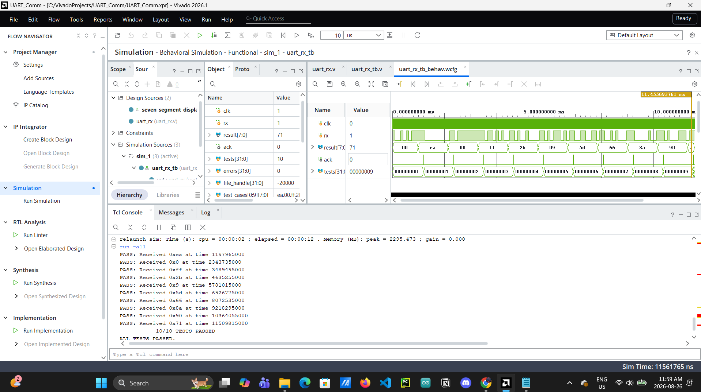
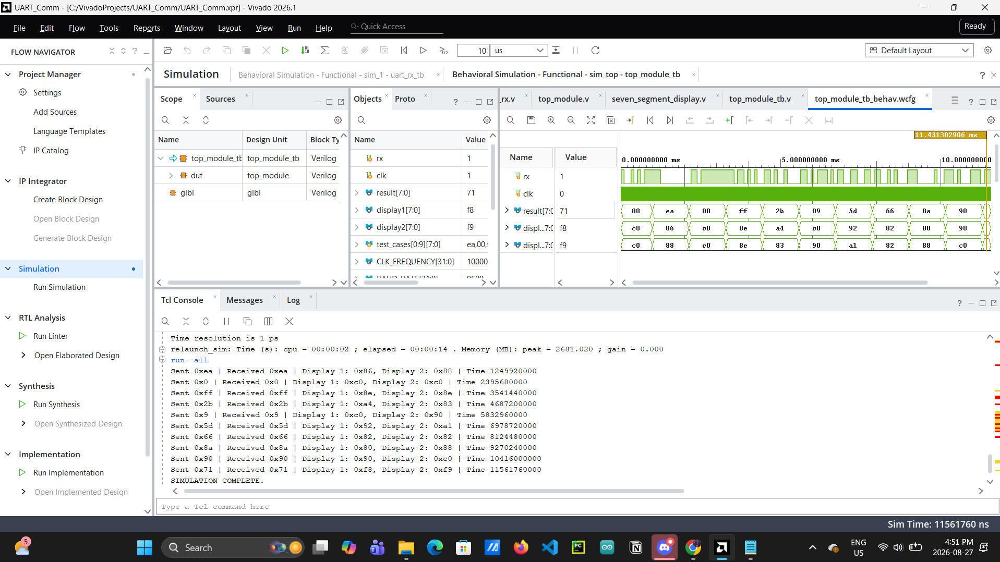

# FPGA UART Receiver: Boolean Board

A UART receiver implemented in Verilog for the [RealDigital Boolean](https://realdigital.org/hardware/boolean) FPGA board (AMD/Xilinx Spartan-7). Bytes sent from a PC over USB-UART are received by the FPGA and displayed on the onboard seven-segment display. This project is a stepping stone toward a larger feedforward neural network (MNIST digit classifier) implemented on the same board, where this UART link will be used to stream input image data from the PC to the FPGA.

## Features

- Custom `uart_rx` module: 9600 baud, 8 data bits, no parity, 2 stop bits
- Falling-edge start-bit detection with mid-bit sampling
- Single-clock-cycle `ack` pulse on successful byte reception
- Top-level integration with a seven-segment display driver for visual verification
- Self-checking Verilog testbenches for each module, plus an integration testbench for the top module
- Python (`pyserial`) command-line transmitter for sending bytes from a PC

## Hardware

- **Board**: RealDigital Boolean (Xilinx Spartan-7 XC7S50)
- **Clock**: onboard 100 MHz oscillator (pin F14)
- **UART**: via the onboard USB-UART bridge on the "PROG UART" connector

## Simulation Results


<p align="center"><em>Simulation waveform for Unit Under Test: uart_rx</em></p>


<p align="center"><em>Simulation waveform for Device Under Test: top_module</em></p>


## Getting started

### Simulate

1. Open the project in Vivado (or create a new project and add the files under `rtl/` and `sim/`).
2. Set the desired testbench as top for its simulation set.
3. Run Behavioral Simulation.

### Program the board

1. Add the `.xdc` constraints from `constraints/boolean.xdc`.
2. Run Synthesis → Implementation → Generate Bitstream in Vivado.
3. Program the Boolean board.

### Send data from a PC

1. Install dependencies: `pip install pyserial`
2. Connect the Boolean board via USB to the PROG UART port.
3. Run the transmitter script:
   ```
   python software/uart_tx.py
   ```
4. Enter 8-bit hex values (e.g. `EA`, `0x2B`) to transmit; the value should appear on the board's seven-segment display. Type `quit` to exit.

## Status

- [x] `uart_rx` module implemented and verified in simulation (10/10 test vectors passing)
- [x] `seven_segment_display` module implemented and verified
- [x] Top-level integration (`uart_rx` + `seven_segment_display`)
- [x] Hardware validation on Boolean board

## Scope
- [ ] Extend to streaming full MNIST images (784 pixels/image)
